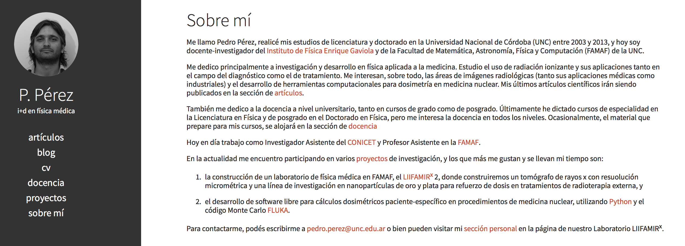

# Análisis y procesamiento de imágenes radiológicas en el ámbito médico

## Presentación del curso

### P. Pérez

#### FAMAF (UNC) & IFEG (CONICET)

---

## Carga horaria

* 60 horas, presenciales
* 30 horas, trabajo en grupos (NO más de 2 personas)

## Modalidad de trabajo

* Clases teóricas
* Clases prácticas
* Ejercicios prácticos a entregar en lapso de 10 días posteriores a la última clase

## Requerimientos

* Computadora personal en clase
* Voluntad de usar diferentes herramientas computacionales!

---

## Contenido del curso

Se organizará el curso en 3 encuentros:

1. Procesos estocásticos y técnicas de simulación MC (**Pedro**)
	* Simulación Monte Carlo para radiodiagnóstico
	* Ejemplos de aplicación
2. Radiodiagnóstico (**Germán**)
	* Imágenes funcionales
	* Reconstrucción tomográfica
3. Monte Carlo en radiología (**Pedro**)
	* PENELOPE y FLUKA
	* Aplicaciones

---

## Material de estudio

* Las filminas no sirven como material de estudio!
* La clásica, los libros!
	* **Bankman, I.N.** *Handbook of medical image processing and analysis. Second Edition.* Elsevier, USA, 2009.
	* **Suetens, P.** *Fundamentals of medical imaging. Second Edition.* Cambridge, UK, 2009.
	* **Bushberg, J.T., Seibert, J.A., Leidholdt E.M. and Boone J.N.** *The essential physics of medical imaging. Second Edition.* Lippincott Williams & Wilkins, USA, 2002.
	* **Epstein, C.L.** *Introduction to the mathematics of medical imaging. Second edition.* SIAM, USA, 2008.
	* **Pajares Martinsanz, G. y de la Cruz García, J.M.** *Visión por computador. Imágenes digitales y aplicaciones. 2º Edición.* RA-MA, España, 2008.

---
## Más material!

* famaf.unc.edu.ar/~pperez1/pages/docencia

* 