# Simulación Monte Carlo con PENELOPE

#### P. Pérez
###### FI-UNER, 5/07/18

---
<!-- page_number: true -->
## Superficies cuádricas

* PENELOPE realiza la simulación sobre cuerpos definidos a partir de superficies cuádricas
* Cada cuerpo debe tener asignado un medio homogéneo (material), puede ser vacío
* Todas las superficies cuádricas pueden ser definidas por la ecuación

$$
\begin{aligned}
F(x,y,z) = &A_{xx}x^2  + A_{xy}xy + A_{xz}xz +  \\
		   &A_{yy}y^2  + A_{yz}yz + A_{zz}z^2 + \\
           &A_x x + A_y y + A_z z + A_0 = 0
\end{aligned}
$$

* Esto incluye planos, pares de planos, esferas, cilindros, conos, elipsoides, paraboloides, hiperboloides, etc.

---
<!-- page_number: true -->
## Superficies cuádricas

* En la prácica, resulta muy difícil establecer los parámetros para una superficie arbitraria.
* Es fácil saber los parámetros para un cilindro de radio R centrado en el origen (0,0,0), pero intenten encontrar los parámetros para el mismo cilíndro si la condición es que sea paralelo al vector (1,1,1).
* Cómo resolverlo? **Con transformaciones y traslaciones!**
* Cada geometría puede ser definida por su ecuación implícita o su forma reducida, que define su "forma", y realizando después transformaciones geométricas (magnificación, traslación, rotación).

---
<!-- page_number: true -->
## Cuádricas reducidas

Una cuádrica reducida queda definida por la expresión:

$$F_r(x,y,z) = I_1 x^2 + I_2 y^2 + I_3 z^2 + I_4 z +I_5 = 0$$

donde $I_i$ para $i=1,2,...,5$ solo puede obtener valores -1, 0 o 1.

*Notar que estas superficies poseen simetría en $z$*

---
<!-- page_number: true -->
## Cuádricas reducidas

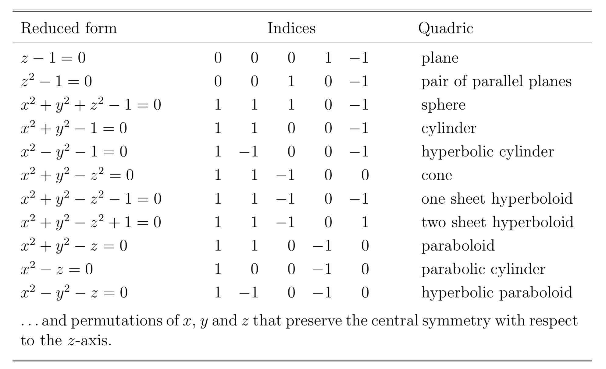

---
<!-- page_number: true -->
## Cuádricas reducidas no planares

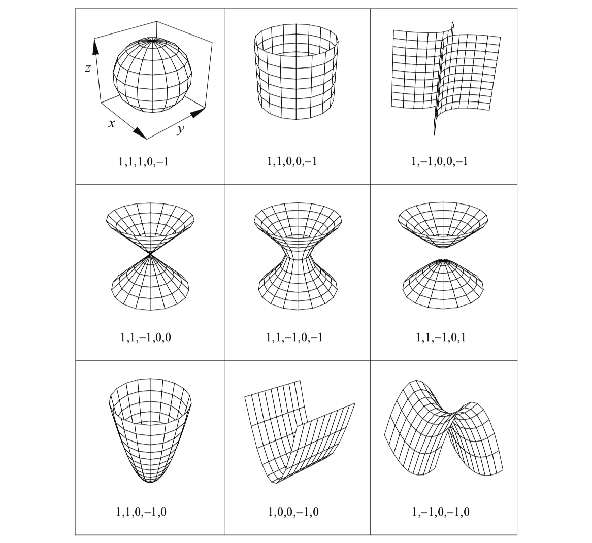

---
<!-- page_number: true -->
## Transformaciones sobre cuádricas reducidas: escaleo

Expansión en dirección de los ejes:
* `X-SCALE = a`
* `Y-SCALE = b`
* `Z-SCALE = c`

La ecuación de la cuádrica escaleada resulta:

$$F_s (x,y,z) = I_1 \left(\frac{x}{a}\right)^2 + I_2 \left(\frac{y}{b}\right)^2 + I_3 \left(\frac{z}{c}\right)^2 + I_4 \frac{z}{c} + I_5 = 0$$ 

---
<!-- page_number: true -->
## Transformaciones sobre cuádricas reducidas: rotación

Una rotación $R(w,\theta,\phi)$ queda definida por los ángulos de euler:

* `OMEGA`=$w$
* `THETA=`$\theta$
* `PHI=`$\phi$

Esta rotación transforma un plano perpendicular al eje z en un plano perpendicular a la dirección de los ángulos polar y azimutal `THETA` y `PHI`, respectivamente.

El ángulo de euler $w$ no tiene efecto cuando la superficie cuádrica inicial es simétrica alrededor del eje z.

---
<!-- page_number: true -->
## Transformaciones sobre cuádricas reducidas: traslación

La traslación está definida por el desplazamiento en cada componente:

* `X_SHIFT=`$t_x$
* `Y_SHIFT=`$t_y$
* `Z_SHIFT=`$t_z$

---
<!-- page_number: true -->

## Definición del archivo de geometría

**Elementos de la geometría**

* Superficies
* Cuerpos
* Módulos

Cada set de datos comienza y termina con una línea de ceros.

La primera línea, después de la separación, debe empezar con una palabra de 8 caracteres: `SURFACE-`, `SURFACE*`, `BODY----`, `MODULE--`, `CLONE---`, `INCLUDE-` o `END-----`. Los espacios en blanco marcados con `-` DEBEN ser respetados.

Los comentarios se escriben a partir de `C-` o `c-` y pueden ser introducidos en cualquier parte del texto.

---
<!-- page_number: true -->

## Formato del archivo de geometría: superficie cuádrica reducida

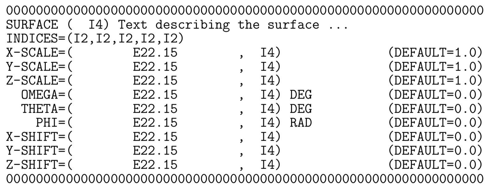

Los parámetros para la superficie son opcionales y se pueden poner en cualquier orden. Por ejemplo, un cilindro elíptico centrado en eje $z$ no necesita definir `Z-SCALE` (notar que los parámetros de escala deben ser >0).

---
<!-- page_number: true -->

## Formato del archivo de geometría: superficie en forma implícita

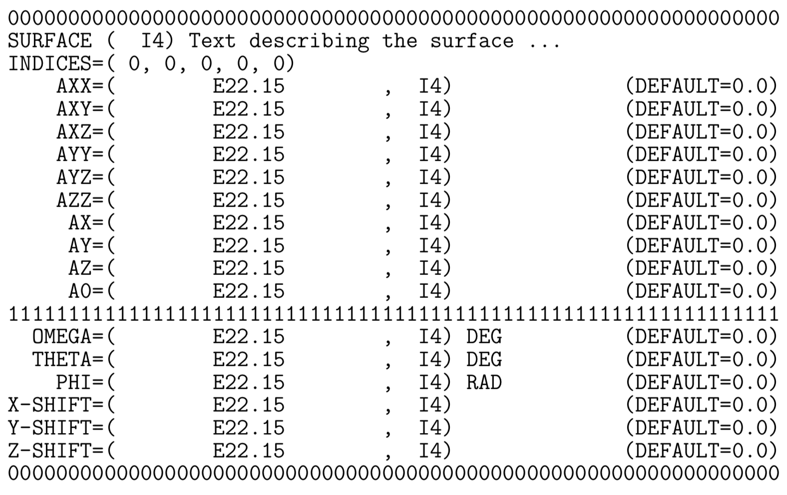

---
<!-- page_number: true -->

## Formato del archivo de geometría: cuerpos

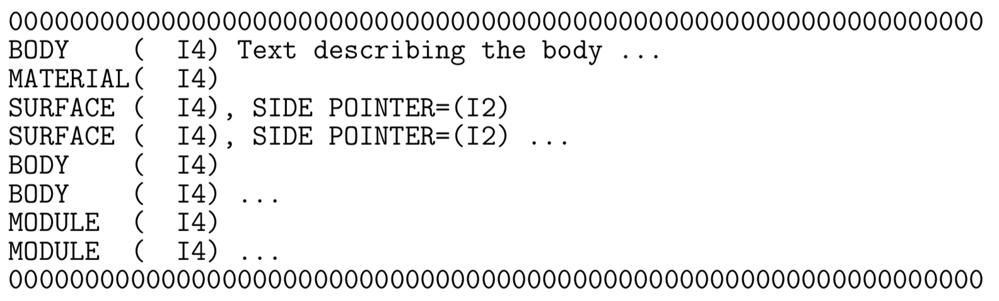

En el cuerpo se define:
* número de cuerpo
* número de material: *determinado por el orden en la lista del input*.
* superficies

Superficies, cuerpos y módulos pueden ser escritos en cualquier orden.

---
<!-- page_number: true -->

## Formato del archivo de geometría: módulos

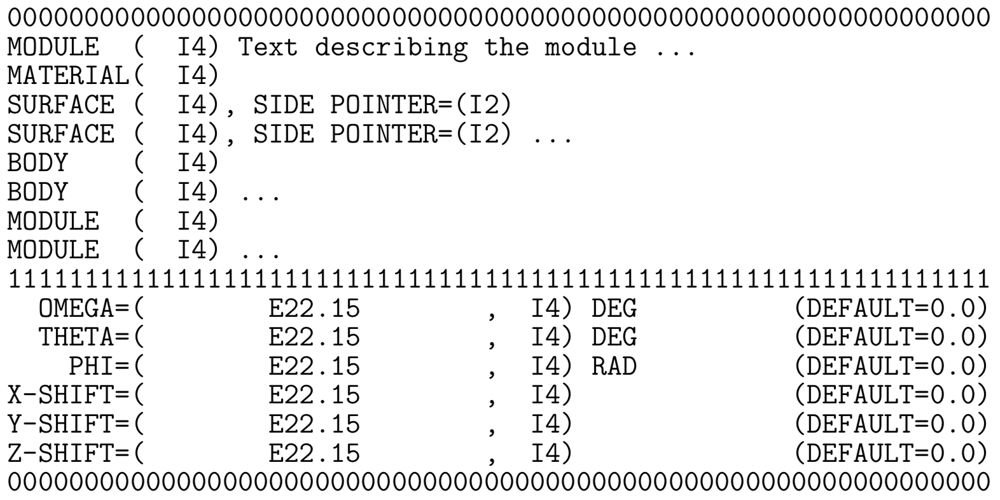

En todos los casos, `MATERIAL=0` define el vacío como "material" del cuerpo/módulo.

---
<!-- page_number: true -->

## Formato del archivo de geometría: clonación

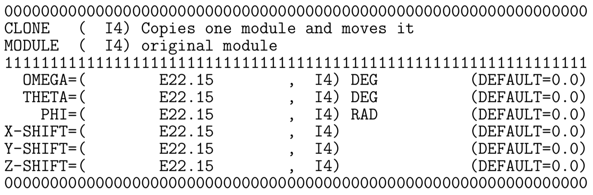

Sólo los módulos son clonables. Para clonar un cuerpo solo delimitado por superficies, es necesario definirlo como módulo.

---
<!-- page_number: true -->

## Formato del archivo de geometría: geometrías externas

Se puede incluir geometrías predefinidas (detector, fuente, etc.) a partir del solo archivo.

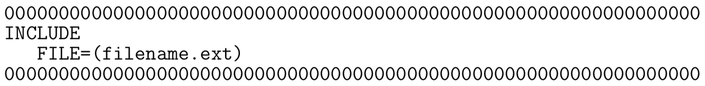

El nombre del archivo debe contener hasta 12 caracteres, si tiene más deben dejarse los espacios en blanco correspondientes a la derecha.

El archivo incluido no puede contener `INCLUDE` dentro.

---
<!-- page_number: true -->

## Formato del archivo de geometría: más info

Para conocer en profundidad cómo se definen las geometrías y los archivos de éstas, se puede consultar el Capítulo 5 del manual de PENELOPE.

El manual está disponible en la carpeta `docs` de la distribución de PENELOPE.

---
<!-- page_number: true -->

## Materiales

* El programa `material.f` puede leer los datos de 280 materiales predefinidos del archivo `pdcompos.p08`
* PENELOPE también puede construir materiales compuestos y mixtos, construyendo las secciones eficaces correspondientes. Esta sección eficaz se construye suma de las secciones eficaces atómicas pesadas por los coeficientes estequiométricos de cada elemento.

---
<!-- page_number: true -->

## Elementos predefinidos

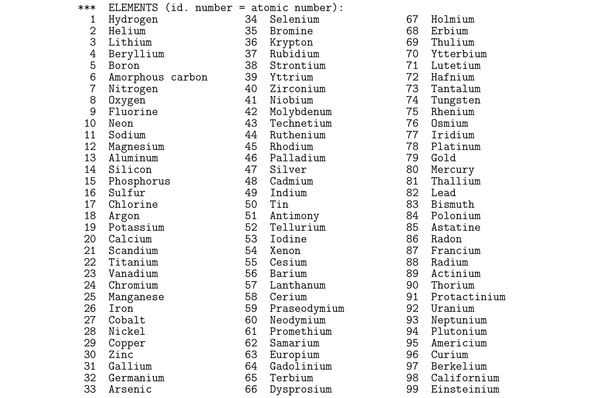

---
<!-- page_number: true -->

## Compuestos predefinidos

De id=100 en adelante se definen compuestos comúnmente utilizados por la comunidad que no necesitan ser creados a través de `material.f`.

Para ver listado de compuestos ver págines 226-229 de manual de PENELOPE.

---
<!-- page_number: true -->

## Parámetros para el control de transporte de $e^-$ y $e^+$

Los parámetros para cada material M son controlados por los siguientes parámetros

* `C1(M)`: deflección angular media, $C_1 \approx 1-\langle cos\theta\rangle$. 0.05 suele ser adecuado, el valor máximo permitido es 0.2
* `C2(M)`: máxima energía media perdida
* `WCC(M)`: energía de corte (eV) para colisiones inelásticas duras
* `WCR(M)`: energía de corte (eV) para emisión de Bremsstrahlung dura

Estos parámetros determinan la velocidad y la presición de la simulación.

---
<!-- page_number: true -->

## Archivo input: título, fuente y espacio de fases


---
<!-- page_number: true -->

## Archivo input: materiales, geometría, interacciones y partículas emergentes

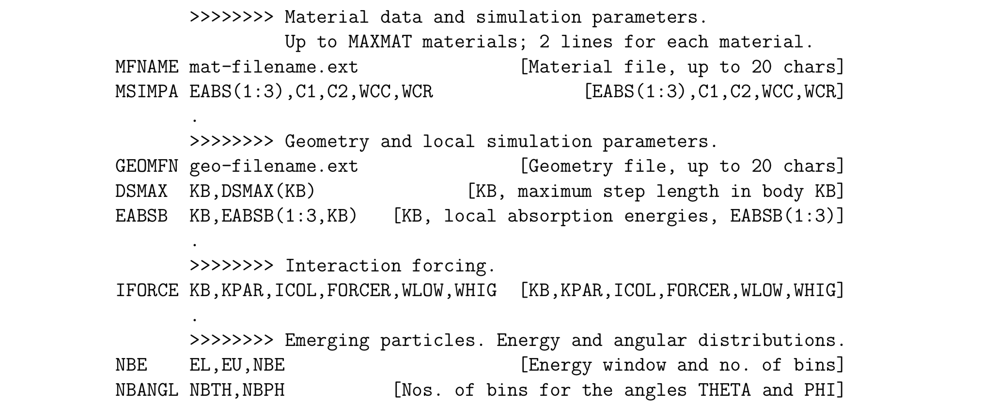

---
<!-- page_number: true -->

## Archivo input: detectores

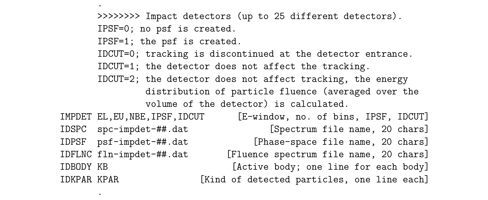

---
<!-- page_number: true -->

## Archivo input: depósito de energía, distribución de dosis y propiedades del trabajo

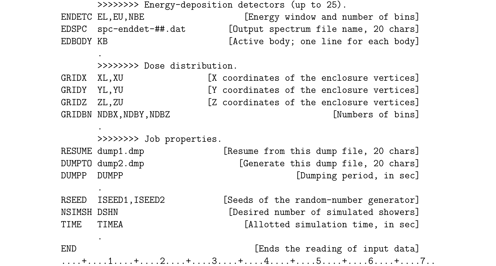

---
<!-- page_number: true -->

## Archivo input: información detallada

Información detallada de cada parámetro en páginas 259-266 del manual de PENELOPE.

---
<!-- page_number: true -->

## Listos para simular

Para poder simular primero hay que contar con las fuentes:

* penelope.f
* penmain.f
* input.in
* archivos de materiales y geometrías

Compilar el ejecutable:

```
gfortran -O3 penmain.f -o penmain.o
```

Correr la simu

```
./penmain.o < input.in
```

Esperar!

---
<!-- page_number: true -->

# Ejercicio práctico

1. Suponga una fuente puntual monoenergética unidireccional de 100keV incidiendo en el centro de una de las caras de un cubo de agua de 10cm de lado. Calcule la distribución de dosis depositada en el mismo.

2. Suponga una esfera de agua, una fuente puntual monoenergética y defina un detector de Si. Calcule el depósito de energía en el detector y construya la imágen que forman en él los rayos X.
