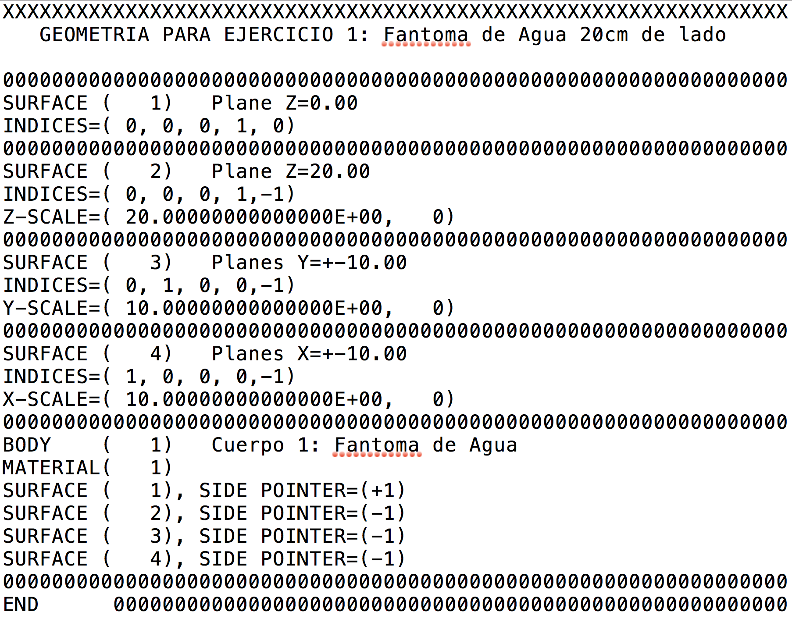
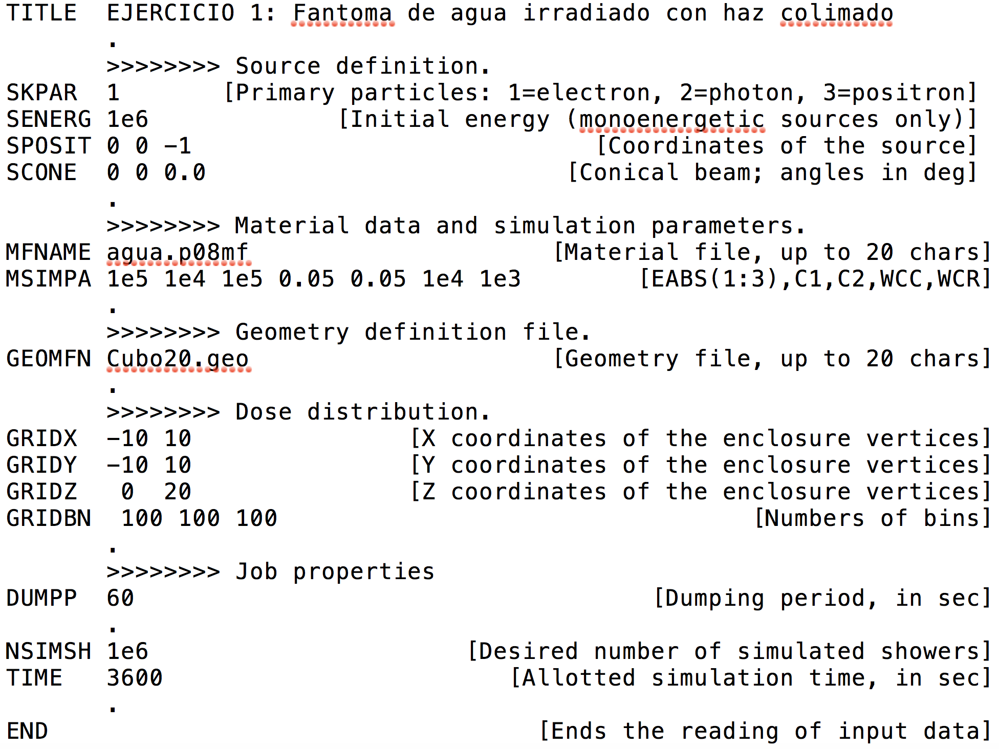

# PENELOPE. Caso de aplicación

#### P. Pérez
###### FI-UNER, 5/07/18

---
<!-- page_number: true -->
## Depósito de energia

Realizamos una simulación Monte Carlo utilizando PENELOPE para calcular el depósito de energía, en la dirección del haz de incidencia, de un haz de electrones de 10 MeV incidiendo en un fantoma de agua cúbico de 20cm de lado, desde el centroide de una de sus caras.

---
<!-- page_number: true -->
## Definición de geometría



---
<!-- page_number: true -->
## Definición de materiales

Para crear los archivos de material es necesario primero crear un ejecutable de `material.f`:

```
gfortran -O3 material.f -o material.o
```

`material.f` se encuentra en la carpeta `fsource/`. Al abrir el archivo veremos que en la primera lína indica:

``` Fortran
INCLUDE 'penelope.f'  ! File included to simplify compilation.
```

Por lo que debe ser compilado en una carpeta que contenga a `penelope.f`.

Una vez generado el ejecutable, éste se corre con:

```
./material.o
```

y se siguen los pasos correspondientes para crear el material deseado.

---
<!-- page_number: true -->
## Input



---
<!-- page_number: true -->
## Archivos

Para correr utilizando el *main* `penmain`, lo compilamos dentro de una carpeta donde se encuentren todos los archivos que indica con `INCLUDE` al inicio. Se compila con:
```
gfortran -O3 penmain.f -o penmain.o
```

Finalmente lo ponemos en la carpeta donde vamos a simular, junto a todos los otros inputs (input, geometría, materiales, etc.), y lo corremos con el comando:

```
./penmain.o < input.in
```

Ahora sí a esperar para ver los resultados.